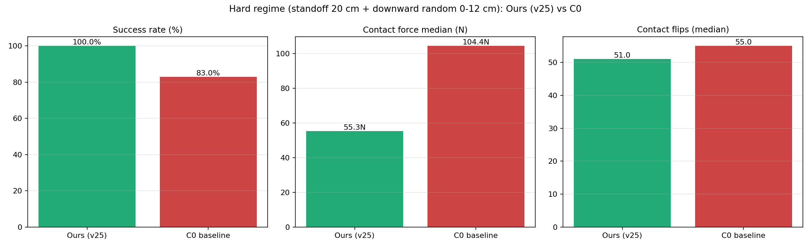
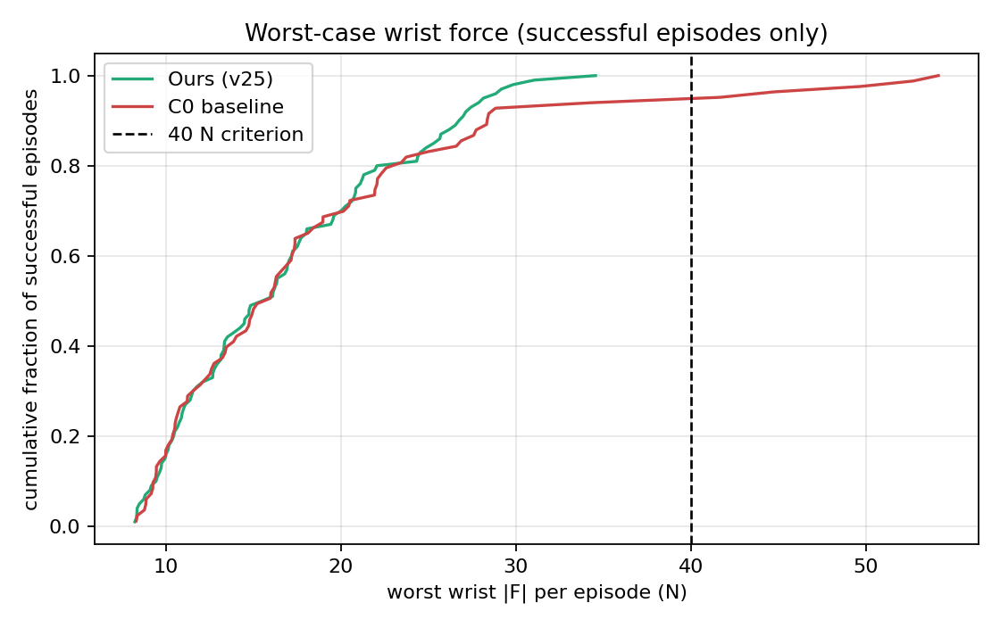
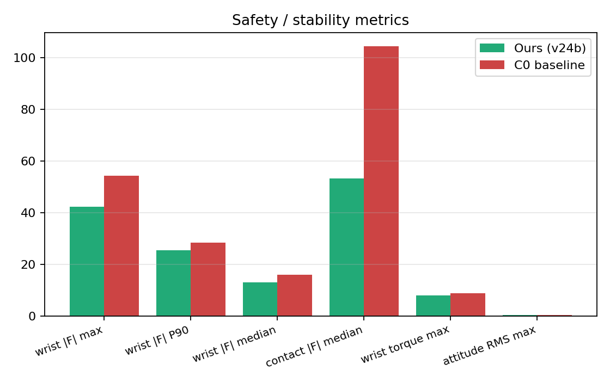

# 第三章 分段式变阻抗强化学习装配方法

## 3.1 引言

在轨服务与精密装配一类任务中，操作对象往往要通过导向结构插入到对接面内，其共同特点是配合间隙小、就位精度要求高，同时对接触力的幅值有严格限制。这类任务的困难并不平均地分布在整段操作上，而是集中在装配对象与对接面发生接触之后的那一小段过程里：接触一旦建立，操作由自由空间运动转变为受约束的接触运动，原先在自由空间中被认为"足够好"的控制特性往往不再适用。

从控制的角度看，这一转变带来的核心矛盾可以表述为对刚度的两种相反需求。装配的前一段是自由空间运动，控制器需要较高的刚度，才能在存在初始位姿偏差的条件下快速、准确地接近对接面，并及时纠正装配对象的姿态；而接触建立之后，控制器刚度会与接触刚度共同构成新的闭环回路，若仍保持同样的刚度，回路往往缺少足够的阻尼裕度，零件将在就位过程中持续振荡，使得位姿难以在连续若干步内稳定成立，就位判据因此不可达。因此，同一次装配中，前段要求"刚"，后段要求"柔"，而任何一组单一的固定增益只能在这一连续变化的折中上取某一个点。

进一步看，本任务的对象几何使这一矛盾更加突出。装配对象上的导向销较长而配合间隙很小，这带来两个后果：其一，末端姿态的微小偏差会在销尖处形成明显更大的横向偏移，因此决定装配能否成功的往往不是位置精度而是姿态精度；其二，接触力经由较长的导向销传递到腕部后会被放大，安全性问题因此集中体现在腕部所受的力与力矩上，而这一事实也决定了最坏受力应当在哪里评价。与此同时，接触状态本身随插入深度演化，导向销在浅插入与深插入时的受力形式并不相同，回路的等效接触刚度因而并非常数。可以说，本任务的难度来自"长导向销"这一几何特征对姿态误差与接触力的双重放大，以及接触状态随深度的持续变化。

已有的处理方式难以同时应对上述两方面。固定阻抗控制把刚度与阻尼取为常数，无法在接近、接触与就位三段之间改变回路特性，只能在接近段暂态的抑制与接触段的稳定之间折中；增益调度或阈值切换的思路虽然引入了分段，却依赖一个"何时转为柔顺"的判据，而该判据在物理上并不容易给出：位置与高度只能说明末端到达了哪里，并不能说明是否已经接触；腕部关节反力中混有运动产生的惯性成分，其自由空间段与接触段的量级相互重叠，无法据此区分接触是否发生。换言之，"切换时刻"并不能由几何量或力信号的瞬时阈值可靠地确定。轨迹规划可以约束接近过程的几何路径与下降速率，但它描述的是期望的运动过程，并不能保证在真实接触发生的那一刻，控制器已经处于合适的阻抗状态；在初始姿态与配合间隙存在随机性的条件下，真实接触时刻并不等于规划所预期的时刻。

基于上述分析，本文把问题重新表述为：在接触事件被可靠识别的前提下，由策略在线重整定任务空间的刚度与阻尼，使控制器在接近段保持柔顺以抑制暂态、在接触段具备横向约束与轴向插入能力、并在就位之后主动退出。围绕这一定位，本文提出分段式变阻抗强化学习方法，其基本出发点是：分段所改变的是任务对控制器提出的目标与约束，而不是由谁来做决策；因此方法保持单一连续策略，把分段只体现为奖励结构与安全约束的变化，并让分段边界由真实接触事件驱动、以连续过渡的形式同时作用于奖励与力上限两条通道。

本章的组织如下：3.2 节给出问题的力学描述、固定阻抗在接触阶段的局限，以及长导向销场景下困难的具体来源与方法依据；3.3 节给出分段式变阻抗控制方法，包括任务空间变阻抗控制律、增益调节型动作空间、接触事件检测与软切换机制、就位锁存与终态稳定机制以及观测空间；3.4 节给出分段式奖励设计；3.5 节给出策略学习与训练配置；3.6 节给出实验设计与评价指标；3.7 节对本章工作做出小结。

## 3.2 问题描述与方法提出

### 3.2.1 问题描述

本节把任务中的主要困难归结为一个问题：在接触发生之后，控制器应当何时、以多大程度转为柔顺。装配的前一段是自由空间运动，控制器需要较高的刚度才能快速、准确地跟随参考并抑制位置偏差；而一旦装配对象与对接面发生接触，同一组刚度会与接触刚度共同构成弱阻尼的弹性—接触回路，使零件在就位过程中持续振荡。实测表明：固定阻抗下未能完成装配的回合中，接触标志在末段反复建立与断开 354 次，姿态偏差的均方根长期维持在 0.268 rad；而完成装配的回合对应值分别为 50 次与 0.022 rad。由于就位判据要求位姿在连续若干步内稳定成立，持续振荡的回合永远不会满足判据，零件也因此无法坐实。相反，若在自由空间阶段就采用低刚度，接近过程会明显变慢并出现跟踪滞后：实测中自由空间段与接触段对刚度的要求方向相反，而一组恒定增益只能偏向其中一侧。

更关键的是，何时转为柔顺没有一个可由几何量给出的解析判据。位置与高度只能说明末端到达了哪里，不能说明是否已经接触；腕部关节反力中混有运动产生的惯性成分，实测中其自由空间段与接触段的量级相互重叠，无法据此区分接触与否。因此该决策只能依据真实接触事件并在线学习。这就是本文要解决的唯一主要问题，也是采用分段式变阻抗并以接触事件驱动切换的直接原因。

### 3.2.2 固定阻抗在接触阶段的局限

本文中的接近段暂态来自接近运动所采用的回路结构本身。控制器在任务空间按比例微分形式生成力螺旋，再经雅可比转置映射为关节力矩，回路中不含惯量整形项，因此闭环动态仍然保留机械臂原有的、与位形相关的惯量[23]。下面用闭环方程说明这一点。

机械臂的关节空间动力学为

    M(q) q̈ + C(q, q̇) q̇ = τ                                                 (3-1)

式中，q 为关节位置；M(q) 为惯量矩阵，它随位形变化；C(q, q̇) 为科氏项与离心项；τ 为关节力矩。本文的仿真设定中，机械臂与装配对象（链条各刚体、ORU 与对接面）均关闭了重力作用，因此动力学中不含重力项，控制器也不需要重力补偿；这一设定对就位阶段的影响见 3.3.5 节。任务空间的比例微分律经雅可比转置映射为关节力矩（其完整形式见 3.3.1 节），即

    τ = Jᵀ(q) (K_p e − K_d ẋ)                                               (3-2)

式中，e 与 ẋ 分别为末端在任务空间中的位姿误差与速度，J(q) 为雅可比矩阵，K_p、K_d 为对角的任务空间刚度与阻尼矩阵。将式 (3-2) 代入式 (3-1)，并利用任务空间速度与关节速度的关系 ẋ = J(q) q̇，可得闭环方程

    M(q) q̈ + [ C(q, q̇) + Jᵀ(q) K_d J(q) ] q̇ = Jᵀ(q) K_p e                (3-3)

式 (3-3) 表明，闭环中仍然保留位形相关的惯量矩阵 M(q)，这与比例微分加补偿反馈的经典结论一致[21,22]。这意味着同一组增益在不同位形下并不对应相同的闭环特性：等效惯量随构型变化，闭环带宽与阻尼比也随之变化，末端在接近行程中的响应快慢沿轨迹而变。此外，只有当任务空间的惯量被整形为常值且各向同性时，上述回路才等价于一组解耦的二阶系统；式 (3-3) 中的惯量项并未被整形，它的各向异性与方向间的耦合使不同方向的收敛并不同步。因此当指令位姿变化较大时，末端的实际轨迹不是沿指令直线的平移，而是一条先偏向某一侧、随后随暂态衰减逐渐收敛回直线的曲线，这就是接近段暂态。任务空间的等效惯量可由

    Λ(q) = ( J(q) M⁻¹(q) Jᵀ(q) )⁻¹                                          (3-4)

表示[24]，它随位形变化这一事实正是上述偏差的来源。

式 (3-3) 与式 (3-4) 说明两点。第一，闭环中参与振荡的惯量随位形变化且未被整形为常值，因此同一组增益在不同构型下对应的闭环阻尼比并不相同：在自由空间中可以接受的刚度与阻尼，在接触约束引入之后不再保证足够的阻尼裕度。第二，接触会给回路额外增加一个弹簧约束，回路于是成为由控制器刚度与接触刚度共同构成的二阶系统；当阻尼不足以压制该系统的振荡时，就位过程中便会出现持续的弹性—接触极限环（其终态处理机制见 3.3.5 节，实测振荡量见 3.6.7 节）。

因此固定阻抗的局限不在于能否靠近目标，而在于接触发生之后无法改变回路特性：或者在自由空间偏软，代价是接近变慢与跟踪滞后；或者在接触段偏硬，代价是持续振荡使就位判据不可达。本文把这一权衡交给策略在线决定，即由策略在接触事件被确认之后重新整定任务空间刚度与阻尼，从而在保留自由空间跟踪能力的同时消除接触段的振荡。

### 3.2.3 分段式方法的提出

分段式方法并不意味着要把控制策略拆成多个互不相干的子策略。本文的设计出发点是：分段所改变的是任务对控制器提出的目标与约束，而不是由谁来做决策。据此，本文提出分段式变阻抗强化学习，其设计原则如下。

第一，分段只体现在奖励结构与安全约束上，策略结构保持单一连续。策略始终输出同一个连续动作，用于在线调节任务空间阻抗增益；阶段的变化表现为奖励的混合比例与轴向力上限的变化，而不表现为动作维度、网络结构或子策略的切换。这样既获得了分阶段的行为差异，又不需要设计离散的子目标与切换逻辑。

第二，分段必须由真实接触事件驱动。位置与高度只能说明末端到达了哪里，不能说明是否发生了接触；腕部关节反力则同时含有运动产生的惯性成分，无法把运动与接触区分开。因此本文以装配对象与对接面之间的真实接触力作为接触事件的判据。

第三，分段切换必须连续，并且同时作用于奖励与力上限两条通道。只让奖励连续而让力上限阶跃，接触瞬间仍会出现冲击；只让力上限连续而让奖励阶跃，策略仍会回避切换区域。本文用同一个速率受限的混合权重同步驱动两条通道。

第四，接触前需要几何引导，接触后需要阻抗重整定。前者通过预插入点与限速的虚拟参考锚点约束接近过程的横向偏差与下降速率；后者是本方法的核心：在接触事件被确认之后，由策略把任务空间刚度与阻尼重新整定到足以抑制弹性—接触极限环的水平，使位姿能够在连续若干步内稳定成立，就位判据因而可达。

上述四条原则构成了本章方法的主体，其数据通路如图 3-1 所示：策略根据观测输出阻抗增益，控制器据此计算关节力矩；与此同时，接触传感器输出真实接触力，经判据与速率受限过渡得到分段权重，该权重同时作用于奖励计算与轴向力上限。

图 3-1 分段式变阻抗强化学习框架总体框图

本章后续各节涉及的装配对象几何量、接触量与整定参数如表 3-1 所列。其中几何量与接触量由装配对象的三维模型与接触实验确定，本文列出其符号与含义，具体数值由实测给出；控制与奖励的整定参数则在 3.3 节与 3.4 节中随方法一并给出。

表 3-1 装配对象的关键几何量与接触量（符号与含义，数值由实测确定）

| 符号 | 含义 | 数据来源 |
| --- | --- | --- |
| L_p | 导向销导向段长度 | 三维模型测量 |
| r_p, r_h | 销名义半径与孔名义半径 | 三维模型测量 |
| c_r | 径向单边间隙 | 三维模型测量 |
| d_xy⁰ | 接触前装配对象的横向偏差及其分布范围 | 仿真轨迹测量 |
| θ⁰ | 接触前装配对象的姿态偏差及其分布范围 | 仿真轨迹测量 |
| e_xy^arc | 自由接近阶段横向偏差的最大值（接近段暂态幅值） | 仿真轨迹测量 |
| F_max^allow | 装配过程允许的接触力峰值上限 | 任务安全要求 |
| F_z^need | 完成最后一段插入所需的轴向力 | 接触实验测量 |
| z_seat | 装配对象与末端各自的就位高度 | 三维模型与标定 |

### 3.2.4 长导向销场景下的困难来源

前两节指出的限制对所有插装任务都成立，而本任务在几何上还有一个容易被忽略、却在很大程度上决定难度的特征：导向销的导向段很长，约为 L_p ≈ 0.20 m，而销与孔之间的径向单边间隙很小。在装配力学中，销的导向长度与配合间隙本来就是决定接触状态的两个关键量，它们同时作用的结果，是把上一节的矛盾进一步放大，并且把任务的主要困难从平动方向搬到了转动方向。下面按"姿态误差如何传递到销尖、销尖受力如何传递到腕部、接触状态如何随插入深度变化"三条链路说明这一点。

**姿态误差被销长线性放大。** 装配对象被夹持后，其导向销的销尖位置由末端位姿与销的几何共同决定。设末端位置偏差为 e_ee、姿态偏差为 θ，则销尖相对名义位置的横向偏差近似为

    e_tip ≈ e_ee + L_p · θ                                                       (3-5)

式 (3-5) 的物理含义是：销越长，相同的姿态偏差在销尖处造成的横向偏移越大，而且是线性放大。以本任务的量级代入，姿态偏差 3°（约 0.0524 rad）对应销尖附加横向偏差约 10.5 mm，而就位判据所要求的横向误差在 2 mm 量级，两者相差五倍以上。也就是说，在本场景中决定装配成败的往往不是末端的位置精度，而是姿态精度；相应地，控制器必须能够在**转动方向上**独立地调整柔顺程度，而不能只在平动方向上做柔顺化处理。

**销尖受力经销长形成力矩杠杆。** 对称地，接触力也不是在销尖处被"消费"掉的，而是经由销长传递到腕部。设销尖受到横向接触力 F_xy，则腕部所承受的力矩近似为

    τ_wrist ≈ F_xy · L_p                                                          (3-6)

同样以 L_p ≈ 0.20 m 代入，销尖上仅 10 N 的横向力就对应腕部约 2 N·m 的力矩；在本工作的实测中，固定阻抗基线的腕部力矩峰值达到 8.66 N·m，说明该杠杆效应在本任务中确实被用满。由此得到两点：其一，长销场景下最坏受力必须在**腕部**而非销尖处评价，本文的最坏力判据因此取腕部六维力传感器的合力峰值；其二，长销使得位置约束与力约束同时变紧，控制器的裕度比短销场景更小。

**卡阻倾向随"已进入长度与间隙之比"上升，且本质上由姿态决定。** 插装接触的经典分析把卡阻（楔紧）视为两点接触下力平衡的边界，其条件可写成

    R = h · sinθ₂ + r · cosθ                                                      (3-7)

式中 h 为已进入导向段的长度，r 为销半径，θ 与 θ₂ 为两点接触处的接触角[25]。式 (3-7) 说明，已进入长度越大、径向间隙越小，越容易落入卡阻分支；本文"长销加小间隙"的组合恰好位于该风险区内。更值得注意的是，卡阻条件中出现的是**接触角**而不是位置偏差，因此卡阻是一个姿态相关现象——这与式 (3-5) 的结论指向同一处：本场景的核心矛盾集中在转动自由度上。

**接触的等效刚度随插入深度漂移。** 除几何之外，销本身的柔性也不可忽略。细长的导向销在轴向压力下可近似为细长梁，其横向柔度与受载形式和已进入长度有关，因此由"控制器刚度与接触刚度共同构成"的二阶回路，其等效接触刚度并非常数，而是随插入深度变化[12,26]。固定阻抗只能针对某一个等效刚度整定，无法同时匹配浅插入（导向尚未建立、接触较软）与深插入（导向已建立、接触较硬）这两个阶段的稳定需求。

**长销还带来长行程与不可忽略的接触瞬间速度。** 由于导向段长，接触发生之前存在一段较长的自由行程——在本文的规范工况中，自由落差为 20~32 cm。按 3.2.2 节的分析，比例微分回路在自由空间中会因未整形的惯量产生接近段暂态，行程越长，该暂态在接触时刻累积的速度与惯量成分越大，而接触瞬间的速度直接决定冲击力的量级。这意味长销场景不仅要求接触之后柔顺，还要求**接触发生的瞬间就已经处于合适的阻抗状态**。

把上述五条合起来，本文场景的困难可以概括为一句话：**长导向销把姿态误差与销尖受力分别放大到"决定成败"与"决定安全性"的量级，而这两者的最优控制特性又随接触状态与插入深度而变，因此控制器必须在自由段、接触段与就位段之间在线改变自身的阻抗特性。**

### 3.2.5 方法依据与文献支撑

上述分析并不是本文的孤立观察，它与装配力学和柔顺控制中的三条经典结论相衔接，同时又留下了本文场景特有的空白；把两者对照，即可得到本文方法的三条设计依据。

**第一条衔接是：装配的困难来自接触状态，而不是定位精度。** 如果对象位置可以被完美控制，精密插入本不构成难题[31]；实际困难来自接触发生之后由摩擦与几何约束形成的接触状态，例如卡阻、楔紧与两点接触，其可行域由式 (3-7) 一类的几何与力平衡条件决定[12,25,26]。这一结论直接支持本文把"接触事件的识别"与"接触之后控制特性的重整定"作为核心问题，而不是把精力放在进一步提高定位精度上。

**第二条衔接是：柔顺是化解接触约束的主要手段，而柔顺作用的位置与量级同样重要。** 被动柔顺装置通过把柔顺中心放置在销尖附近，使横向与转动偏差被吸收而不转化为卡阻力矩[27]；主动侧对应的则是阻抗与导纳控制，即通过在线整定刚度与阻尼间接设定力的传递关系与柔顺中心[21,23,24]。这条线索说明，有效的柔顺必须作用在正确的自由度上并具有正确的量级，因此本文把策略的动作空间设计为**在线整定任务空间刚度与阻尼**，而不是离线选定一组固定增益。

**第三条衔接是：由学习在线整定阻抗在接触丰富的插装任务中已被证明可行。** 近期工作把阻抗参数交给策略输出，在接触丰富或多接触插装任务上学习变阻抗策略，并通过约束或奖励引导其进入可行域[28,29]；也有工作在装配操作中直接使用腕部力传感器闭环调节装配条件[30]。这些结果说明本文选择的"学习式变阻抗"路线本身是被认可的方向；在此基础上，本文把决策问题进一步明确为**由接触事件驱动的分段整定**。

在上述三条衔接之外，本文场景还有一个尚未被充分覆盖的空白：已有工作大多针对较短的销或较大的配合间隙，或把接触状态视为可以由规划预先安排的过程。而在**长导向销、小间隙、大行程**这一组合下，由 3.2.4 节的五条分析可以直接导出三条设计依据。**其一，方法必须分段，且三个阶段对刚度的需求方向相反**：接近段需要柔顺，以抑制由未整形惯量引起的接近段暂态与末端甩动，同时避免在长行程末段带着过大的速度与惯量进入接触；接触段需要较低的转动刚度与足够的阻尼，以便吸收被放大的销尖偏差、避开式 (3-7) 所描述的卡阻分支，并抑制"控制器刚度—接触刚度"回路的极限环；就位段又需要足够的轴向刚度与力，以克服摩擦与卡阻完成最后一段插入。任何单一固定增益都只能在其中一段达到最优，这正是 3.6.7 节中固定阻抗基线在收紧落差后成功率下降的根源。**其二，分段的边界不能由预规划的时刻给出，只能由真实接触事件给出**：接触发生的时刻取决于实际初始姿态与配合间隙（式 (3-5) 与式 (3-7)），而初始姿态在随机化条件下并不可预知；同时，腕部关节反力中混有运动产生的惯性成分，其自由空间段与接触段的量级相互重叠，无法据此判断接触是否发生（3.2.1 节）。因此，任何"先按标称轨迹走到某个固定位置、再切换为柔顺"的做法都无法保证在真实接触时刻处于正确的阻抗状态。**其三，柔顺的程度应由学习决定，而不能由阈值给定**：卡阻与振荡的分界与销长、间隙、姿态和插入深度强耦合（式 (3-5) 至 (3-7)），难以给出一个在全部初始条件下都成立的解析阈值；把"何时转为柔顺、柔到什么程度"交给策略在线决定，正是本文采用强化学习、而不是采用固定增益调度或单一阈值切换的根本原因。也正因如此，本文把分段体现为**奖励混合比例与轴向力上限的连续过渡**，而不改变策略结构，从而在获得分阶段行为的同时避免离散子策略切换引入的不连续。

值得强调的是，上述依据给出的是**可检验的预测**，而不是对实验结果的解释。依据预测：自由落差减小时，可用于纠正被放大姿态误差的行程随之变短，固定阻抗的性能应当首先在成功率上退化，而能够在线重整定阻抗的方法应能保持成功率并降低接触力与抖动。3.6.7 节的实测与这一预测一致——在自由落差约 31 cm 的常规工况下，固定阻抗已能完成大部分装配（成功率 91.0%），方法收益主要体现在接触力与终段稳定性上；把自由落差收紧到 20 cm 并向下随机 0~12 cm 之后，固定阻抗的成功率降至 83.0%，而本文方法达到 99.0%，接触力中位数同时降低约一半。依据先于结果提出、并被结果支持，是本文把长导向销作为方法出发点的主要理由。

## 3.3 分段式变阻抗控制方法

### 3.3.1 任务空间变阻抗控制律

设末端执行器在世界坐标系下的位置与姿态分别为 p_e 与单位四元数 q_e，线速度与角速度分别为 v_e、ω_e，期望位姿为 p_d 与 q_d。任务空间比例与阻尼增益为对角阵 K_p = diag(k_p)、K_d = diag(k_d)，其中 k_p、k_d ∈ R⁶ 分别对应三个平动与三个转动自由度。位置误差取

    e_p = p_d − p_e                                                        (3-4)

姿态误差取目标姿态与当前姿态之四元数误差的轴角表示 e_o，并对四元数符号做最短路径处理，以避免大角度路径跳变。任务空间阻抗控制律为

    W = K_p [e_p; e_o] − K_d [v_e; ω_e]                                    (3-5)

式中，W ∈ R⁶ 为任务空间力螺旋，前三维为力、后三维为力矩；第二项为阻尼项，用于抑制速度引起的振荡。控制器在每个物理子步都根据最新物理状态刷新式 (3-5)，而不是在控制周期内保持常数，以避免阻尼项在控制周期上产生的混叠。

为抑制接触时的微小力抖动与极限环，控制律输出先经死区处理，再按轴限幅：

    W' = sgn(W) ⊙ max(|W| − d, 0)                                          (3-6)

    W'' = clip(W', −W_max, W_max)                                          (3-7)

式中，d 为各轴的死区阈值；W_max 为各轴的力与力矩上限，其中横向力上限与轴向力上限分别取值，轴向力上限不再是常数，而是由接触状态决定的分段量（见 3.3.4 节）。将任务空间力螺旋映射到关节空间：

    τ = Jᵀ W''                                                              (3-8)

式中，J 为机械臂的几何雅可比矩阵；关节力矩统一限幅。由于仿真中所有刚体的重力作用均已关闭（见 3.2.2 节），控制器不需要重力补偿项。式 (3-5) 至式 (3-8) 说明了本文变阻抗的作用路径：策略并不直接输出关节力矩，而是通过调节 k_p、k_d 间接改变关节力矩，从而在任务空间中得到期望的柔顺或刚性行为。

### 3.3.2 增益调节型动作空间

若让策略直接输出增益的绝对值，需要同时保证正定性与数值范围，探索效率低且容易发散；既有工作表明，以任务空间中的变阻抗作为动作空间，或在其上引入约束引导，都能显著改善接触丰富任务的训练效果[2,3,5]。因此本文采用相对基线的缩放型动作空间。设策略输出动作 a_t ∈ [−1, 1]¹²，前六维用于比例增益、后六维用于阻尼增益，则

    s_p = clip(1 + λ a_t[0:6], s_min, s_max)                               (3-9)

    s_d = clip(1 + λ a_t[6:12], s_min, s_max)                              (3-10)

    k_p = k_p⁰ ⊙ s_p,  k_d = k_d⁰ ⊙ s_d                                    (3-11)

式中，k_p⁰、k_d⁰ 为柔顺基线的默认阻抗参数，λ 为增益调节幅度，s_min、s_max 为缩放系数上下限。缩放型动作空间有三个好处：正定性由构造保证；当动作取零时控制器退化为一个经过验证的柔顺基线，策略的搜索起点总是稳定的；不同自由度的动作具有一致的物理含义，便于策略表达轴向更硬、横向更软这类结构性差异。

### 3.3.3 分段式参考轨迹与虚拟参考锚点

姿态期望恒定为对接面的目标姿态，XY 期望恒定为对接面中心，仅 Z 向期望随时间变化。第一阶段中，Z 向期望保持在就位面上方 h_pre 的预插入高度；当满足引导进入条件后进入第二阶段，Z 向期望按速率受限方式向就位点下降：

    z_ref,t+1 = z_ref,t + clip(z_des − z_ref,t, −v_ref Δt, +v_ref Δt)       (3-12)

    z_des = z_seat − δ_i α_f,t                                              (3-13)

式中，v_ref 为虚拟参考锚点的最大下降速率；z_seat 为末端就位高度；δ_i 为插入偏置，即在接触后把参考锚点压到就位面以下，以形成持续的下压趋势；α_f,t 为接触驱动的力通道混合权重。由式 (3-12) 可见参考锚点的下降速率有界，因而从预插入点到就位面的行程不会在瞬间完成，接触不会以冲击的形式发生。

为防止参考锚点在横向偏差重新变大时继续下压而加剧楔紧，本文对锚点施加预压释放保护：当横向偏差或姿态偏差超出对齐容差、或深度误差已超过就位容差时，锚点不再向下推进，而是回退到不高于当前末端高度的位置：

    z_des = max(z_e,t, z_ref,t)   ，当对准失效或深度超限时                      (3-14)

式中，z_e,t 为当前末端高度。该保护使失去对齐时预压被平滑释放，而不是被强制保持。需要强调的是，该保护的触发阈值必须与成功判据保持一致，二者不可分离修改。

### 3.3.4 接触事件检测与软切换机制

接触事件的检测是本节方法的关键。如 3.2.3 节所述，位置与高度不能表征接触，而腕部关节反力含有运动产生的惯性成分，在自由空间中即已显著非零，与接触后的读数区间相互重叠，无法用阈值区分。为此，本文在装配对象与对接面之间直接配置过滤式接触传感器，只报告这两个刚体之间的接触力[13,14]：该力在自由空间中为零，仅在真实接触发生时随压入而上升。

设接触传感器输出的最强接触力矢量的模长为 F_c，接触标志 c_t 由带滞回与去抖的判据给出：

    c_t = (对齐成立) ∧ (F_c > F_on) 连续 N_c 步确认，或 (c_{t−1} ∧ F_c ≥ F_off)   (3-15)

式中，F_on 与 F_off 分别为接触确认与释放阈值，二者构成滞回以避免阈值附近的反复跳变；N_c 为连续确认步数，用于抑制单步尖峰引起的误触发。判据中同时要求对齐成立，目的是避免装配对象在侧面刮碰对接面边缘时被误判为进入插入阶段；若实验表明侧面刮碰需要更严格的区分，可在式 (3-15) 中增加接触力以轴向分量为主的条件。

在此基础上，用速率受限的一阶过渡把离散的接触标志转换为连续权重：

    α_{f,t} = α_{f,t−1} + clip(c_t − α_{f,t−1}, −Δα, +Δα),  Δα = Δt / T_sw    (3-16)

式中，T_sw 为切换过渡时间。该权重同时作用于两条通道：其一是轴向指令力上限，即

    F_z,t = F_z^free + (F_z^ins − F_z^free) α_{f,t}                        (3-17)

式中，F_z^free 与 F_z^ins 分别为自由接近段与插入段的轴向力上限，因此力上限是连续过渡而非阶跃跳变；其二是奖励的混合权重 α_{s,t}，其递推形式与式 (3-16) 相同，用于 3.4 节的分段奖励混合。二者使用同一个接触标志与同一个过渡时间，从而保证奖励变硬与力上限放开在时间上严格同步。

这里需要区分引导段标志与接触标志。本文将参考锚点的调度（式 (3-12) 至 (3-14)）称为引导段标志 φ_t，其进入条件由接近预插入点与对齐成立共同决定，作用仅是决定虚拟参考何时开始以受限速率缓降；真正决定分段的标志是接触标志 c_t。二者分离的理由是：参考锚点必须在预插入高度处即开始下降，否则没有机制把装配对象平稳带向就位面；而奖励与力上限必须由真实接触决定，否则策略会在接触之前就承担插入段的全部代价（见 3.4.4 节）。图 3-2 给出一条名义工况下接触力、接触标志、奖励混合权重与轴向力上限的时序关系。

图 3-2 接触事件驱动的软切换时序

### 3.3.5 就位锁存与终态稳定机制

当装配对象进入几何就位区间后，若继续保留位置反馈，控制器会持续对抗接触约束，形成弹性—接触极限环，表现为装配对象在就位面上反复弹跳，使速度与角速度被判据拒之门外。为此本文采用就位锁存：当横向偏差、深度误差与姿态偏差三项均进入容差并连续满足若干步后，置位锁存标志 l_t，并在锁存期间把两套反馈增益置零：

    k_p ← 0,  k_d ← 0    ，当 l_t = 1                                       (3-18)

仅置零增益并不充分。由于本文的仿真设定关闭了各刚体的重力作用（见 3.2.2 节），装配对象并不存在指向就位面的自然重力：反馈力一旦消失，装配对象会在接触约束的作用下回弹到无穿透的平衡位置，即高于就位位置，深度判据随之失效。因此在置零增益的同时施加恒定的向下任务空间前馈力：

    W_ff = [0, 0, −F_hold, 0, 0, 0]                                        (3-19)

式中，F_hold 为保持力。该前馈力叠加于式 (3-5) 的反馈输出之后、死区与限幅之前，因此仍受式 (3-6) 与式 (3-7) 约束。采用零增益加恒定前馈而非单纯零增益或纯前馈，其意义在于：恒定前馈不含位置反馈，不会向弹簧—接触系统注入能量去激励极限环；同时它又提供了必要的向下保持力，使装配对象稳定停留于就位面。就位锁存并非永久锁存，若装配对象在后续步骤中离开几何就位区间，计数器复位，正常的位置反馈自动恢复，因此该机制不会掩盖失败状态。

### 3.3.6 观测空间与状态表征

策略观测由十个分量组构成，具体如表 3-2 所示。

表 3-2 策略观测空间构成

| 分量组 | 维度 | 内容 | 设计说明 |
| --- | --- | --- | --- |
| 阶段状态 | 5 | 引导段标志、奖励混合权重、力通道混合权重、参考锚点相对就位高度的偏置、历史最佳插入深度 | 使策略能看见当前所处阶段 |
| 末端位置 | 3 | 末端相对对接面的位置 | 任务空间定位主状态 |
| 末端姿态 | 4 | 末端相对对接面的四元数 | 与姿态奖励一致 |
| 末端线速度 | 3 | 由雅可比映射得到的末端真实线速度 | 供阻尼项与稳定判据使用 |
| 末端角速度 | 3 | 同上，角速度分量 | 同上 |
| 关节位置 | 6 | 各关节角度 | 保留机械臂自身状态 |
| 比例增益 | 6 | 当前生效的任务空间比例增益 | 使策略感知自身刚度的变化 |
| 阻尼增益 | 6 | 当前生效的任务空间阻尼增益 | 同上 |
| 指令力螺旋 | 6 | 上一时刻控制器实际输出的任务空间力螺旋 | 区分指令与实测 |
| 实测力 | 3 | 腕部关节反力 | 提供接触相关的力信息 |
| 上一动作 | 12 | 上一时刻的增益调节动作 | 便于学习动作平滑性 |

表 3-2 中第一组阶段状态是本文在观测设计上的关键处理。若把分段标志与混合权重只保留在环境内部而不放入观测，则同一观测在不同阶段可能对应完全不同的最优动作，任务在策略看来退化为部分可观测马尔可夫决策过程，策略需要依靠历史自行推断阶段，训练效率显著下降。此外，把历史最佳插入深度放入观测具有明确的物理含义：深度进展奖励只对新的最优深度发放（见 3.4.3 节），策略需要知道自身已经深入到什么程度，才能判断继续下压是否仍有收益。价值网络额外使用对接面位姿、当前增益与判据阈值等状态量，用于更准确地估计回报。

### 3.3.7 算法整体流程

综合 3.3.1 至 3.3.6 节，本文方法的单个控制周期流程如算法 3-1 所示。

算法 3-1 分段式变阻抗强化学习单步流程

    输入：当前观测 o_t
    1  策略网络输出动作 a_t ∈ [−1, 1]¹²；
    2  按式 (3-9) 至 (3-11) 计算缩放系数与阻抗增益；
    3  读取接触传感器，按式 (3-15) 更新接触标志 c_t；
    4  按式 (3-16) 更新力通道权重 α_f,t 与奖励混合权重 α_s,t；
    5  按式 (3-12) 至 (3-14) 更新虚拟参考锚点；
    6  若就位锁存置位，按式 (3-18) 与式 (3-19) 置零增益并施加保持力；
    7  在每个物理子步按式 (3-4) 至 (3-8) 计算并施加关节力矩；
    8  按式 (3-17) 设定轴向力上限；
    9  计算奖励（3.4 节），更新阶段状态与就位判据，得到下一观测 o_{t+1}。

## 3.4 分段式奖励设计

### 3.4.1 奖励总体结构

本文的奖励由两个阶段奖励、一个公共对齐奖励、安全与平滑惩罚以及完成奖励构成：

    R_t = (1 − α_{s,t}) R_t⁽¹⁾ + α_{s,t} R_t⁽²⁾ + R_t^align + R_t^safe + R_t^act + R_t^succ     (3-20)

式中，R⁽¹⁾ 为阶段一（接近与对齐）奖励；R⁽²⁾ 为阶段二（接触插入与精收敛）奖励；α_{s,t} 为式 (3-16) 给出的速率受限混合权重；R^align 为公共姿态对齐奖励；R^safe 为接触力安全惩罚；R^act 为动作幅值与变化率惩罚；R^succ 为完成奖励。式 (3-20) 与已有两阶段装配方法的共同点是阶段性目标分离，不同点在于混合权重由真实接触事件驱动并连续变化，而不是按回合内的时间或步数硬性划分。

此外，式 (3-20) 的总奖励在环境中统一乘以一个比例系数。该系数是均匀仿射变换，不改变各项奖励之间的相对关系，也不改变最优策略，其作用是便于在需要时整体调整回报量级；由于回合在就位判据成立时即终止（见 3.4.5 节），回报不再随回合剩余长度增长，因此本文取该系数为 1。

下文记装配对象相对对接面的横向偏差为 d_xy，深度误差为 Δz，姿态偏差为 θ，末端到目标点的距离为 d_target；对齐成立指横向偏差与姿态偏差同时进入相应的对齐容差。

### 3.4.2 阶段一奖励

阶段一的目标是把末端从初始位姿带到预插入点并完成对齐，其奖励由四部分构成：

    R_t⁽¹⁾ = r_prog + r_dev + r_tgt + r_app                                (3-21)

路径进度项以末端在起始点至预插入点连线上的投影进度为自变量，而不使用离散关键点。设起始点位置为 p_start、预插入点为 p_end，投影参数为 t_p = clip((p_e − p_start)·(p_end − p_start)/‖p_end − p_start‖², 0, 1)，剩余路径比例为 x = 1 − t_p，则

    r_prog = Σ_{k=1}^{3} φ(x; a_k, b_k)                                     (3-22)

    φ(x; a, b) = 1 / (e^{a x} + b + e^{−a x})                               (3-23)

式中，(a_k, b_k) 取三组尺度参数，分别对应远距离粗接近、中距离对齐与近距离精定位三种尺度，其形式沿用快速接触仿真的装配基准中的多尺度挤压函数[6]。多尺度叠加的作用是让奖励在整段接近过程中都保持有效梯度：单一尺度的挤压函数只在某一距离区间内敏感，远离该区间时梯度趋于零，而接近行程跨越了较大的距离范围，需要多尺度覆盖。走廊偏差项惩罚末端偏离连线的垂直距离 d_dev：

    r_dev = −w_dev d_dev                                                    (3-24)

该项在连线上处处为零（包括终点），因此不会产生把末端拉回连线中点的副作用。目标点项在终点附近提供更陡的梯度：

    r_tgt = φ(d_target; a_tgt, 0)                                           (3-25)

距离进展塑形项按末端到目标点距离的减少量发放增量奖励：

    r_app = w_app (d_target,t−1 − d_target,t)                                (3-26)

该项使下降行程的中段也带有稳定的正向梯度，其形式属于基于距离的势函数塑形，本文不对其策略不变性做声明[17]。公共姿态对齐奖励在式 (3-20) 中单独列出，按末端姿态与目标姿态夹角 θ_e 的指数形式发放：

    R_t^align = w_ali exp( −(θ_e / σ_ali)² )                                 (3-27)

该奖励仅在姿态接近对齐时才显著非零，因此不会鼓励策略停留在接近但未对齐的状态。阶段一各奖励项及其整定参数如表 3-3 所示。

表 3-3 阶段一奖励项与整定参数

| 奖励项 | 表达式 | 参数含义 | 取值 |
| --- | --- | --- | --- |
| 路径进度 | 式 (3-22)(3-23) | 三组距离尺度 (a_k, b_k) | (5, 4), (50, 2), (100, 0) |
| 走廊偏差 | 式 (3-24) | 偏差权重 w_dev | 2.0 |
| 目标点逼近 | 式 (3-25) | 终点锐化系数 a_tgt | 150 |
| 距离进展 | 式 (3-26) | 进展权重 w_app | 5.0 |
| 姿态对齐 | 式 (3-27) | 权重 w_ali 与尺度 σ_ali | 2.0 与 0.1 |
| 动作幅值 | ‖a_t‖₂ | 权重 w_a | 0.01 |
| 动作变化率 | ‖a_t − a_{t−1}‖₂ | 权重 w_Δa | 0.001 |

### 3.4.3 阶段二奖励

阶段二的目标是在接触约束下完成插入并稳定保持，其奖励由深度进展、深度误差、横向与姿态残差、未完成惩罚以及接触力相关惩罚构成：

    R_t⁽²⁾ = r_zin + r_zdep + r_xy + r_ang + r_unf + r_fs + r_lat            (3-28)

深度进展项只对新的最优深度发放：

    r_zin = w_zin · clip(g_best,t−1 − g_t, 0, δ_max) · 1[对齐 ∧ (Δz ≥ −ε_z)]  (3-29)

式中，g_t = max(Δz, 0) 为剩余深度误差，g_best,t = min(g_best,t−1, g_t) 为历史最优深度并作为状态量写入观测；δ_max 用于限制单步奖励幅值；ε_z 为就位深度容差。该设计的关键在于只奖励刷新纪录：若按深度本身发放稠密奖励，策略可以通过抬起再插回同一深度反复领取进度奖励；按最优深度发放则使同一深度的重复到达不再产生收益。

深度误差项对过浅与过深两侧同时惩罚，而不是只在过浅时惩罚：

    r_zdep = −w_zd · relu(|Δz| − ε_z)                                       (3-30)

其意义在于防止策略以过插换取奖励：销与孔为线对线配合，过插意味着接触穿透量超出容许范围。横向与姿态残差项按各自容差归一化后惩罚：

    r_xy = −w_xy · d_xy / ε_xy,   r_ang = −w_ang · θ / ε_θ                    (3-31)

归一化使两项在恰好处于容差边界时贡献相同的量级。未完成惩罚在未达到稳定成功前每步扣减：

    r_unf = −w_unf · 1[未达到稳定成功]                                        (3-32)

接触力相关惩罚包括三项：力变化率惩罚 r_fs = −w_fs|F_t − F_{t−1}|，用于抑制力的阶跃；峰值力惩罚并入式 (3-20) 的安全项 R^safe = −w_pk relu(F_t − F_pk)²，其阈值与插入段轴向力上限一致，以避免对完成插入所必需的轴向力本身进行惩罚；横向接触力惩罚 r_lat = −w_lat‖F_xy‖，用于抑制以横向力硬顶的楔紧行为。阶段二各奖励项及其整定参数如表 3-4 所示。

表 3-4 阶段二奖励项与整定参数

| 奖励项 | 表达式 | 参数含义 | 取值 |
| --- | --- | --- | --- |
| 深度进展 | 式 (3-29) | 权重 w_zin 与单步上限 δ_max | 500 与 0.01 m |
| 深度误差 | 式 (3-30) | 权重 w_zd | 100 |
| 横向残差 | 式 (3-31) | 权重 w_xy | 0.5 |
| 姿态残差 | 式 (3-31) | 权重 w_ang | 0.5 |
| 未完成惩罚 | 式 (3-32) | 权重 w_unf | 2.5 |
| 力变化率 | −w_fs\|ΔF\| | 权重 w_fs | 0.005 |
| 峰值力 | −w_pk relu(F − F_pk)² | 权重 w_pk 与阈值 F_pk | 0.01 与轴向力上限一致 |
| 横向接触力 | −w_lat‖F_xy‖ | 权重 w_lat | 0.1 |

### 3.4.4 软切换与接触段回避

本节说明式 (3-20) 中混合权重设计方式的必要性。若让插入段奖励自预插入高度起即完全生效，则在接触发生之前，策略每步都要承担阶段二的全部代价：深度误差惩罚、横向与姿态残差惩罚以及未完成惩罚，而此时它并不能获得插入段的主要收益。于是停在接触之前成为策略的局部最优：停在预插入点附近可以避免接触段的持续代价，而接近段本身的正奖励又足以维持策略不退出。这一现象与 3.1 节提到的分层方法中的奖励跳变问题同源[4]，本质是分段边界处的收益与代价不匹配。

本文的处理方式是让混合权重由真实接触标志驱动（式 (3-15) 与式 (3-16)）。由于接触标志在自由空间中恒为零，α_{s,t} 在接触前严格为零，阶段二在混合奖励中的贡献也严格为零；而 α 以有限的过渡时间连续上升，接触之后插入段奖励不会出现阶跃。这样同时消除了回避接触段与奖励跳变两个问题。该机制的正确性可以通过两条可测量的判据检验：接触之前阶段二奖励在混合奖励中的贡献是否严格为零，以及接触时刻奖励混合权重与轴向力上限的过渡时间是否为设计值。

### 3.4.5 成功判据与奖励的一致性

本文的装配成功判据定义在装配对象本体上，而不是末端上。原因在 3.2.1 节已经说明：装配对象经固定关节链条与末端相连，末端到达位置并不等价于装配对象进入孔内。成功判据要求以下五项同时成立并连续保持一段规定时间：

    d_xy < ε_xy,  |Δz| < ε_z,  θ < ε_θ,  ‖v_oru‖ < ε_v,  ‖ω_oru‖ < ε_ω       (3-33)

式中，v_oru 与 ω_oru 分别为装配对象本体的线速度与角速度。判据首次满足时发放一次完成奖励

    R_t^succ = w_succ · 1[判据首次成立]                                       (3-34)

该奖励为一次性终端奖励，回合在判据成立的同一步终止。这样处理有三个好处。其一，回报不再随回合剩余长度增长：此前完成奖励按步发放，回合越长累计越多，回报量级与回合长度耦合，既不利于比较也容易掩盖真实进度。其二，装配完成的事件不再等到回合结束才出现，成功与超时能够被区分统计，成功率的统计不再被超时回合稀释。其三，各环境完成的时刻不同，训练过程中完成的回合会连续到达，评价指标与回报曲线的更新频率不再受回合长度限制。

由于奖励改为一次性发放，其量级必须与阶段奖励的持续收益相比较来确定。若策略在接触前保持对齐，其每步可获得对齐奖励，按折扣因子 γ 折算的现值约为 w_ali/(1−γ)，因此完成奖励需取到与之同量级或更高（本文取 w_succ = 1000），才能使完成装配优于停在接触之前；否则策略会满足于停在目标附近而不完成最后一段插入。表 3-5 列出成功判据各项的符号、含义与阈值来源。

表 3-5 成功判据的构成与阈值来源

| 判据项 | 符号 | 含义 | 阈值来源 |
| --- | --- | --- | --- |
| 横向偏差 | ε_xy | 装配对象相对对接面中心的横向偏差上限 | 孔口配合要求 |
| 深度误差 | ε_z | 装配对象高度相对就位高度的双侧偏差上限 | 就位精度要求 |
| 姿态偏差 | ε_θ | 装配对象轴线相对目标姿态的夹角上限 | 销孔配合要求 |
| 线速度 | ε_v | 就位判定所需的线速度上限 | 稳定判据 |
| 角速度 | ε_ω | 就位判定所需的角速度上限 | 稳定判据 |
| 保持时间 | t_hold | 上述条件需连续保持的时长 | 稳定判据 |

需要强调的是，式 (3-33) 中的三项几何容差同时被用于三处：成功判据、阶段二奖励的归一化尺度（式 (3-30) 与式 (3-31)）以及虚拟参考锚点的回退保护（式 (3-14)）。三者共享同一组容差值是刻意的设计选择：若奖励使用的容差比判据宽松，策略会满足于判据不可达的状态；若比判据更严，策略会在判据已满足时仍被惩罚，二者都会使训练目标与评价目标错位。

## 3.5 策略学习与训练配置

### 3.5.1 网络结构与算法

本文以近端策略优化（Proximal Policy Optimization, PPO）[15]为基础算法，并在策略网络与价值网络中引入长短期记忆网络（LSTM）以处理接触过程的时序依赖。策略网络的输入为 3.3.6 节给出的观测，输出为十二维动作的分布参数；价值网络使用同一观测并附加对接面位姿与判据阈值等状态量。选择 PPO 与循环结构的理由有两点：一是 PPO 的裁剪目标函数在接触主导任务中比确定性策略梯度方法更稳定，且便于并行环境采样；二是接触事件本身具有时序性（接触力上升、滞回、混合权重累加），循环结构使策略能够利用历史观测判断接触是否刚刚发生，这与把阶段标志放入观测的做法互为补充。

### 3.5.2 训练配置

训练在第二章构建的并行仿真环境[18,19]中进行，主要配置如表 3-6 所示。

表 3-6 训练配置

| 参数 | 取值 | 说明 |
| --- | --- | --- |
| 并行环境数 | 64 | 并行采样 |
| 物理步长 | 1/120 s | 物理仿真步长 |
| 控制步长 | 1/15 s（每 8 个物理步更新一次动作） | 策略决策频率 |
| 回合长度 | 上限 90 s（1350 个控制步），就位判据成立即终止 | 成功时提前结束，达上限视为超时 |
| 单轮采样量 | 128 × 64 | 采样水平线长与环境数之积 |
| 训练轮数 | 100 | 预算约束，不代表收敛 |
| 小批量大小 | 512 | 每轮多次小批量更新 |
| 折扣因子 | 0.995 | 长回合下的有效折扣 |
| 随机种子 | 0，并计划扩展到 0/1/2 | 用于报告不确定性 |

表中给出的 90 s 是回合长度上限：回合在就位判据成立时立即终止，只有未成功的尝试才会走到上限。因此该值需要覆盖最慢的成功过程——早期采用较短的预算时，末端在回合结束时仍处于下降过程中，接触阶段根本没有机会开始——而不需要为「成功后继续保持」预留时间。回合长度不影响单轮训练的采样量（由水平线长与环境数共同决定），因此放宽上限不会增加单轮训练时间；需要留意的是，上限越长，单位采样量内能容纳的完整回合越少，即初始条件多样性在单个训练轮内的覆盖变少，这也是把回合上限从早期更长的预算回调到 90 s 的原因。

### 3.5.3 域随机化与初始条件

本文的域随机化施加在起始位姿上，目标位姿始终保持不变。具体做法是：每次重置时先把机械臂置于默认关节角并通过正运动学求得默认末端位姿，再在该位姿上叠加随机偏移，随后用阻尼最小二乘逆运动学求解相应关节角作为初始状态。这样做的目的是让策略学习从不同初始构型收敛到同一目标，而不是学习追踪一个随机变化的目标。初始偏移量级需要与任务的可达性相匹配：偏移过大时任务在固定增益下亦不可达，会在训练早期产生大量无信息的失败回合；因此偏移量级需与任务可达性匹配。本文的位置随机化取 x∈[−12,0] cm、y∈±12 cm、z 不随机，姿态各轴 ±3 度：远离插槽方向与竖直向上方向的可达余量很小（腕部高度处水平可达半径约 0.42 m，而基座到插槽距离约 0.40 m），故按可达性裁剪随机化区间，并在评估时按偏差档位分别报告，用于考察泛化能力。

### 3.5.4 训练可复现性与模型选择

为保证实验可比性，本文对训练过程作如下约定：每次训练使用唯一的实验目录名，避免不同配置的日志与权重混用；随机种子显式指定并记录；只保留训练奖励最高的模型权重，以节省存储并保证同一训练内模型选择规则一致；训练配置、环境配置与代码版本一并记录。需要指出的是，按训练奖励选择模型权重是工程上的折中，可能与不使用训练回报评价方法优劣的原则产生表面冲突，因此本文只把该规则用于同一方法内部的模型选择，方法之间的比较仍使用独立评估工况上的任务指标。

## 3.6 实验设计与评价指标

### 3.6.1 实验总体设计

本文的实验分为三类。第一类是组件级验证，用于证明方法的各个组成部分按设计工作，为后续比较提供归因基础；第二类是对比实验，用于验证所提方法相对于固定阻抗控制与单阶段控制的有效性；第三类是消融实验，用于分析各设计要素的独立贡献。之所以把组件级验证单列，是因为接触丰富与长程操作任务的评价对实现细节高度敏感[7,8,10]，并且从零开始学习直插式装配的成功仍高度依赖任务分解方式[20]。三类实验共用同一套评估协议：使用独立的初始条件清单（所有方法读取同一清单，避免各自随机带来的不可比性）、固定评估工况、关闭策略探索噪声、每回合正确归零循环网络隐状态，并统一在相同的容差与成功判据下统计指标。实验矩阵如表 3-7 所示。

表 3-7 实验矩阵

| 实验类别 | 编号 | 方法/设置 | 需要训练 | 目的 |
| --- | --- | --- | --- | --- |
| 组件级验证 | V1 | 接触信号先验真 | 否 | 证明接触判据的输入信号正确 |
| 组件级验证 | V2 | 切换判据检测指标 | 否 | 证明接触检测与切换的正确性 |
| 组件级验证 | V3 | 下游一致性校验 | 否 | 证明切换确实作用到奖励与安全约束 |
| 组件级验证 | V4 | 失效注入 | 否 | 证明切换对结果确有影响 |
| 对比实验 | C0 | 固定阻抗控制（无策略） | 否 | 不使用学习的下界对照 |
| 对比实验 | C1 | 单阶段奖励加变阻抗 | 是 | 分段结构的对照 |
| 对比实验 | Ours | 本文分段式变阻抗强化学习 | 是 | 完整方法 |
| 消融实验 | A1 | 去掉阶段一路径与走廊项 | 是 | 几何引导的作用 |
| 消融实验 | A2 | 去掉分段（固定权重混合） | 是 | 分段结构的作用 |
| 消融实验 | A3 | 硬切换（奖励不软混合） | 是 | 软过渡的作用 |
| 消融实验 | A4 | 奖励硬/软与力上限硬/软的组合 | 是 | 分离两类平滑的贡献 |

### 3.6.2 对比方法设置

C0 为固定阻抗控制：不训练策略，直接使用固定增益与固定轴向力上限，用于给出不使用学习的下界。C1 为单阶段控制：使用与本文完全相同的观测空间、动作空间与网络结构，但奖励不分区段，直接使用阶段二奖励的全过程形式，用于分离分段奖励结构的作用。Ours 为本文完整方法。三者使用相同的网络结构、训练预算、随机种子与评估工况，使差异只能归因于方法结构。

### 3.6.3 消融实验设置

A1 移除阶段一奖励中的路径进度项与走廊偏差项，用于考察显式几何引导的作用，其效果主要体现在接近段的横向偏差与轨迹质量指标上。A2 把式 (3-20) 中的混合权重替换为固定常数，用于考察由接触事件驱动分段相对于固定混合的作用。A3 把软混合替换为二值权重，用于单独考察软过渡的作用；需要说明的是，A3 只消融了奖励的软混合，轴向力上限仍连续过渡，因此不能据此宣称消融了全部平滑机制。若要分离奖励平滑与力上限平滑的独立贡献，可按 A4 进行组合实验。

### 3.6.4 评价指标

设评估工况集共 N_case 个（由随机化初始位姿与可选的物理参数档位构成），第 j 个工况重复评估 R 次，则装配成功率定义为

    SR = (1/(N_case R)) Σ_{j=1}^{N_case} Σ_{r=1}^{R} 1[第 (j, r) 次评估满足式 (3-33)]   (3-35)

每个训练种子单独统计，报告逐种子结果与均值、标准差，并给出二项比例的置信区间。成功率以回合为单位，每回合最多计一次成功。除成功率外，本文使用七组指标从不同角度评价方法，其定义与优化方向如表 3-8 所示。

表 3-8 评价指标定义汇总

| 指标组 | 指标 | 符号 | 单位 | 优化方向 |
| --- | --- | --- | --- | --- |
| 任务效果 | 装配成功率 | SR | — | 越大越好 |
| 任务效果 | 首次成功时间 | T_succ | s | 越小越好 |
| 任务效果 | 失败率与超时率 | — | — | 越小越好 |
| 安全性 | 接触力峰值 | F_max | N | 越小越好 |
| 安全性 | 接触力 95 分位数 | F_95 | N | 越小越好 |
| 安全性 | 横向接触力峰值与均方根 | F_xy | N | 越小越好 |
| 安全性 | 任务空间力矩峰值 | τ_max | N·m | 越小越好 |
| 安全性 | 接触力变化率峰值 | max\|dF/dt\| | N/s | 越小越好 |
| 安全性 | 接触冲量 | I_F | N·s | 越小越好 |
| 稳定性 | 接触抖动次数 | n_chat | — | 越小越好 |
| 稳定性 | 就位后残余线速度与角速度 | v_rms, ω_rms | m/s, rad/s | 越小越好 |
| 稳定性 | 静停深度误差 | e_z | mm | 越小越好 |
| 轨迹质量 | 横向偏差均方根与峰值 | e_xy | mm | 越小越好 |
| 轨迹质量 | 末端轨迹长度 | L_ee | m | 越短越好 |
| 轨迹质量 | 末端与装配对象轨迹偏差 | e_chain | mm | 反映链条柔性 |
| 切换质量 | 漏检率与误触发率 | — | % | 越小越好 |
| 切换质量 | 切换延迟均值与 95 分位数 | t_lag | ms | 越小越好 |
| 学习效率 | 达到指定成功率的采样步数 | — | 步 | 越小越好 |
| 泛化性 | 不同间隙、摩擦与偏差档位下的成功率 | SR(·) | — | 分布内外分别报告 |

其中，安全性指标直接对应 3.2.1 节提出的最后装配阶段需保持较小力峰值这一要求，因此本文把接触力峰值、95 分位数、横向接触力与力矩峰值作为与同类工作可比的核心安全性指标[1]；切换质量指标是本文特有的指标组，用于评价接触检测与软切换本身，其评估必须独立于任务成功率，否则无法区分方法有效与侥幸成功；学习效率指标遵循同类研究的建议，不跨奖励设计比较训练回报的高低，一律以独立评估集上的任务指标随采样步数的变化曲线来报告。

### 3.6.5 组件级验证的验收准则

组件级验证为上述指标提供可信度基础，因此需要明确的验收准则。对接触信号（V1）：在装配对象远离对接面时接触力读数应恒为零，在已知下压力下接触力读数应与下压力线性一致，正压时接触力方向应以轴向为主。对切换判据（V2）：以几何接触真值为参考，在全评估集上应无漏检、无误触发，切换延迟的 95 分位数小于规定的延迟上限，且每回合接触标志的翻转次数不超过规定次数。对下游一致性（V3）：轴向力上限与混合权重应满足式 (3-17) 的关系，接触前阶段二奖励在混合奖励中的贡献应严格为零，观测中的阶段状态应与环境内部状态逐步一致。对失效注入（V4）：把接触力人为置零、加偏置或延迟后，接触标志、插入段奖励与就位锁存应按预期失效，任务成功率显著下降，以此作为切换机制确实起作用的直接证据。上述准则通过统一的诊断与校验脚本自动输出报告表。

### 3.6.6 统计分析方法

本文的实验统计遵循以下约定：主要结论以独立评估集上的任务指标为依据，不以训练回报为依据[16]；不同方法之间使用相同的初始条件清单进行配对比较，以降低初始条件差异带来的方差；每个学习组至少使用三个随机种子，报告逐种子结果与均值加减标准差，并给出差值的不确定区间；在样本量有限的条件下不对统计显著性作断言，只报告效应量与区间；所有中间产物（原始逐回合数据、汇总表与绘图脚本）随实验一并保存，保证结论可复现。

### 3.6.7 实验结果

本节报告规范工况下的对比结果。规范工况（下称"更难工况"）把机械臂末端初始高度设为**就位位姿上方 20 cm，并在此基础上下向随机 0~12 cm**（即初始落差在 20~32 cm 之间均匀取值），其余随机化保持不变：横向 x∈[−12,0] cm、y∈[−12,12] cm，姿态 ±3°（0.0524 rad），参考始终为**单目标点**（就位位姿，不提供参考轨迹）。评价使用 100 个环境、每个环境跑满 450 步（15 Hz 策略、30 s 回合预算）、随机种子 1234，所有环境同一时刻复位（不因成功提前终止）。力的统计**只取成功回合**，最坏力判据为**腕部六维力传感器合力峰值 ≤ 40 N**（15 Hz 采样、含链条惯性，与真机腕部传感器可比）。

对比方法为 **Ours（v24b）**：12 维增益缩放动作（6 个比例增益 + 6 个阻尼增益，缩放范围 gain_range = 0.5，即增益在 ±50% 内可调）加**第 13 维学习得到的软切换系数 α**，α 同时驱动奖励分段混合与轴向力上限（8→60 N），并按 switch_duration_s = 0.3 s 做速率限制；奖励为本文分段式奖励。训练 100 个 epoch、随机种子 0，每 10 个 epoch 存一次快照，最终以**独立评估**选择模型。基线 **C0** 为固定阻抗控制：恒定任务空间比例/阻尼增益 k_p = 100 N/m、k_d = 40 N·s/m，策略动作恒置为零，且只给定单一目标点参考。需要说明的是 C0 的动作恒为零，因此 gain_range 的设置不影响基线，两者在同一环境配置下可比。

**表 3-9 规范工况（更难工况：落差 20 cm + 向下随机 0~12 cm）下 Ours 与 C0 的任务与安全性指标**

| 指标 | Ours（v24b，学习切换 + 学习增益） | C0（固定阻抗，无策略） | 相对变化 |
| --- | --- | --- | --- |
| 装配成功率 | **99.0%（99/100）** | 83.0%（83/100） | **+16.0 个百分点** |
| 腕部合力峰值 中位 / P90 / 最大 | **13.03 / 25.36 / 42.18 N** | 15.97 / 28.37 / 54.15 N | 中位 −18.4%，P90 −10.6%，**最大 −22.1%** |
| 最坏腕部力是否 ≤ 40 N | 42.18 N（**略超 2.18 N**） | 54.15 N（超 14.15 N） | 超线幅度收窄 84.6% |
| 腕部轴向力峰值 最大 | 41.35 N | 53.05 N | -22.0% |
| 腕部横向力峰值 最大 | 20.30 N | 24.70 N | -17.8% |
| 接触传感器力峰值 中位 / P90 / 最大 | **53.2 / 152.1 / 697.8 N** | 104.4 / 172.2 / 437.6 N | 中位 **−49.0%** |
| 接触翻转次数 中位 | **39** | 55 | −29.1% |
| 腕部力矩峰值 最大 | 8.00 N·m | 8.66 N·m | −7.6% |
| 末端姿态残差 RMS 最大 | **0.267 rad** | 0.338 rad | −21.0% |
| 末端角速度残差 RMS 最大 | 0.100 rad/s | 0.097 rad/s | +3.1% |

表 3-9 给出三点判断。

第一，**成功率在更难工况下成为有区分度的指标**：固定阻抗控制的成功率从常规工况（落差约 31 cm）的 91.0% 下降到 83.0%，说明当初始落差收紧、可用于纠偏的行程变短时，固定增益难以同时满足"快速接近"与"稳定就位"；而本文方法达到 **99.0%**，比基线高 16.0 个百分点。这一变化的意义在于：在常规工况下成功率已接近饱和（91.0% 对 95.0%），方法的贡献只能体现在力与稳定性上；而在更难工况下，成功率本身即可作为主要指标。

第二，**安全性指标全面改善**：逐回合接触力峰值的中位数从 104.4 N 降到 53.2 N（−49.0%），腕部合力峰值最大值从 54.15 N 降到 42.18 N（−22.1%），接触翻转次数中位数从 55 降到 39（−29.1%），末端姿态残差最大值从 0.338 rad 降到 0.267 rad。其中最有物理意义的一项是：**最坏腕部力几乎全部来自轴向分量**（Ours 41.35 N / 合力 42.18 N；C0 53.05 N / 合力 54.15 N），即安全性问题的实质是**控制插入方向上的压入力**，这与 3.2.1 节对终段受力性质的分析一致。

第三，**最坏腕部力尚未完全达标**：Ours 的最大腕部合力为 42.18 N，比 40 N 的判据线高出 2.18 N（C0 高出 14.15 N，超线幅度收窄 84.6%）。本文如实报告该结果，并将其列为当前方法的局限之一（见 3.6.6 节与 3.7 节）。

**训练稳定性的诊断与修复。** 在得到上述结果前，训练过程中出现过一类可复现的后期退化：策略在 epoch 40~60 一度达到较高成功率，随后在 epoch 50~75 之间快速跌落至接近零（共 6 次独立复现）。定位过程中先后排除了两类假设：其一是"任务在该工况下存在几何不可解的初始位姿"，但把工况改为本文规范工况（落差 20~32 cm）后仍复现，说明与初始位姿的可解性无关；其二是"奖励设计给悬停留出了收益空间"，为此把阶段一状态项改造为势函数差分（r = Φ(s′) − Φ(s)，Ng 等 1999，策略不变性），使静止/悬停的奖励贡献约为零，并加入全阶段停滞惩罚、把超时惩罚提高到与成功奖励同量级，然而退化仍然发生（此时退化策略的每回合回报已从旧奖励下的 +566 变为 −3211）。最终由训练健康度指标定位到原因：**策略动作噪声的标准差始终未收缩**（熵恒定在 18.6，恰为 13 维高斯在 σ = 1 时的上界，说明 σ 从未降低），同时**策略损失单调单向漂移**（a_loss 由 −0.003 漂移到 −0.018），而价值损失、KL 与学习率均正常（KL 自适应调度 kl_threshold = 0.008，学习率稳定在 1e−4）。据此采取两项修改：把增益缩放范围 gain_range 由 2.0 收紧到 0.5（在 σ ≈ 1 的动作噪声下，增益只在其 ±50% 范围内摆动），并把 rollout 长度 horizon_length 由 128 步延长到 256 步。修改后训练 100 个 epoch 全程未再出现退化，成功率峰值与末值均为 0.969（训练端），且末轮检查点可直接使用——这是本工作中首次得到的"既稳定又高水平"的训练曲线。

图 3-x Ours 与 C0 在规范工况（落差 20 cm + 向下随机 0~12 cm）下的成功率、接触力中位数与接触翻转次数对比

图 3-y 成功回合最坏腕部合力峰值的累积分布（虚线为 40 N 判据线）

图 3-z 安全性与稳定性指标对比（腕部力峰值/P90/中位、接触力中位、腕部力矩峰值、姿态残差最大值）

**常规工况的参考结果。** 为说明上述改善并非仅限于收紧落差这一种情形，表 3-10 给出常规工况（落差约 31 cm、其余设置相同）下的参考结果。在该工况下成功率已接近饱和，方法的贡献主要体现在接触力与稳定性上。

**表 3-10 常规工况（落差约 31 cm）参考结果**

| 指标 | 本文方法（阈值切换 + 学习增益） | C0（固定阻抗） |
| --- | --- | --- |
| 装配成功率 | **95.0%** | 91.0% |
| 腕部合力峰值 中位 / P90 / 最大 | 14.99 / 26.37 / **37.95 N（达标）** | 12.24 / 27.25 / 31.63 N（达标） |
| 接触传感器力峰值 中位 / 最大 | **47.0 / 533.5 N** | 86.9 / 450.9 N |
| 接触翻转次数 中位 | **39** | 55 |
| 腕部力矩峰值 最大 | **7.26 N·m** | 8.66 N·m |

表 3-10 显示：常规工况下本文方法把成功率从 91.0% 提升到 95.0%，把接触力峰值中位数降低约 46%（86.9 N → 47.0 N）、把接触翻转次数中位数降低约 29%（55 → 39），且最坏腕部力保持在 40 N 判据线以内（37.95 N），与基线同量级。两个工况合起来说明：**在留有余量的常规工况下，方法主要改善力与稳定性；在收紧落差的更难工况下，方法同时显著改善成功率与安全性。**

**局限与说明。** 其一，本节结果来自单一随机种子（seed 0）的独立评估，多随机种子的重复实验与置信区间有待补充，因此上述差值应视为趋势性结论而非统计显著性结论。其二，最坏腕部力在更难工况下为 42.18 N，仍略高于 40 N 判据线。其三，接触传感器所记录的力峰值为子步（1/120 s）离散化下的数值量级（最大可达 697.8 N），远高于 15 Hz 腕部传感器所能观测到的水平，因此本文以腕部力为最坏力判据、把接触传感器力仅作参考列出。其四，检查点与动作/观测维度及模型配置绑定，跨配置评估会产生维度或状态字典不匹配，故模型选择必须在与训练完全一致的配置下进行。

## 3.7 本章小结

本章针对 ORU 装配中长导向销使装配对横向偏差极为敏感、而末端位姿无法反映销端真实位置这一核心问题，分析了装配过程不同接触状态对控制器的相反要求，指出固定阻抗与单一奖励难以同时适配，而分层或离散分段又会引入子目标设计与奖励跳变问题。在此基础上，本章提出了分段式变阻抗强化学习方法：保持单一策略与连续动作空间，由真实接触事件驱动奖励混合权重与轴向力上限的速率受限软过渡，配合预插入点与限速虚拟参考锚点实现接触前的几何引导，并通过就位锁存与恒力保压实现终态稳定。本章给出了控制律、动作空间、参考轨迹、接触判据、奖励函数、观测空间与训练配置的完整定义，并给出了包含组件级验证、对比实验与消融实验的实验设计以及以成功率、接触力峰值等为核心的评价指标。后续章节将在此设计下完成实验并给出结果分析。

## 本章参考文献

[1] Meng X, Huang S, Yang J, et al. From Reach to Insert: Tactile-Augmented Precision Assembly under Sub-Millimeter Tolerances[C]//IEEE/RSJ International Conference on Intelligent Robots and Systems (IROS), 2026. arXiv:2605.04649. https://arxiv.org/abs/2605.04649

[2] Martín-Martín R, Lee M A, Gardner R, et al. Variable Impedance Control in End-Effector Space: An Action Space for Reinforcement Learning in Contact-Rich Tasks[C]//IEEE/RSJ International Conference on Intelligent Robots and Systems (IROS), 2019. arXiv:1906.08880. https://arxiv.org/abs/1906.08880

[3] Constraint-Grounded Reinforcement Learning for Variable Impedance Control in Contact-Rich Robotic Insertion. arXiv:2609.13516. https://arxiv.org/abs/2609.13516

[4] PPO-Based Dual-Layer Dual-Hole Pallet Insertion Without Inter-Layer Constraints Via Hierarchical Reinforcement Learning[J]. IEEE Transactions on Instrumentation and Measurement. https://ieeexplore.ieee.org/abstract/document/11526358

[5] DA-VIL: Adaptive Dual-Arm Manipulation with Reinforcement Learning and Variable Impedance Control. arXiv:2410.19712. https://arxiv.org/abs/2410.19712

[6] Narang Y, Sundermeyer M, Van Wyk K, et al. Factory: Fast Contact for Robotic Assembly[C]//Robotics: Science and Systems (RSS), 2022. https://roboticsproceedings.org/rss18/p035.pdf

[7] A review on reinforcement learning for contact-rich robotic manipulation tasks[J]. Robotics and Computer-Integrated Manufacturing, 2023. https://www.sciencedirect.com/science/article/pii/S0736584522001995

[8] A scoping review of reinforcement learning methods for long horizon robotic manipulation[J]. 2026. https://link.springer.com/content/pdf/10.1007/s44430-026-00037-1.pdf

[9] Towards cost-effective and safe contact-rich robotic manipulation with reinforcement learning: A review of techniques for future industrial applications[J]. Proceedings of the Institution of Mechanical Engineers, Part C, 2025. https://journals.sagepub.com/doi/10.1177/09596518251350353

[10] 基于强化学习的机器人装配接触力控制研究综述[J]. 机械工程学报, 2025. https://qikan.cmes.org/jxgcxb/CN/PDF/10.3901/JME.2025.10.395

[11] Active compliant motion: a survey[J]. Advanced Robotics, 2005, 19(5). https://doi.org/10.1163/156855305323383767　（作者与页码待核对补全）

[12] Whitney D E. Quasi-Static Assembly of Compliantly Supported Rigid Parts[J]. Journal of Dynamic Systems, Measurement, and Control, 1982, 104(1): 65-77.

[13] Schoettler G, Nair A, Luo J, et al. Deep Reinforcement Learning for Industrial Insertion Tasks with Visual Inputs and Natural Rewards[C]//IEEE/RSJ International Conference on Intelligent Robots and Systems (IROS), 2020. arXiv:1906.05841.

[14] Lee M A, Zhu Y, Zachares P, et al. Making Sense of Vision and Touch: Self-Supervised Learning of Multimodal Representations for Contact-Rich Tasks[C]//IEEE International Conference on Robotics and Automation (ICRA), 2019. arXiv:1810.10191.

[15] Schulman J, Wolski F, Dhariwal P, et al. Proximal Policy Optimization Algorithms. arXiv:1707.06347. https://arxiv.org/abs/1707.06347

[16] Henderson P, Islam R, Bachman P, et al. Deep Reinforcement Learning that Matters[C]//AAAI Conference on Artificial Intelligence, 2018. arXiv:1709.06560. https://arxiv.org/abs/1709.06560

[17] Ng A Y, Harada D, Russell S. Policy Invariance under Reward Transformations: Theory and Application to Reward Shaping[C]//International Conference on Machine Learning (ICML), 1999: 278-287.

[18] Mittal M, Roth A, Wocke J, et al. Orbit: A Unified Simulation Framework for Interactive Robot Learning Environments[J]. IEEE Robotics and Automation Letters, 2023. arXiv:2301.04195.

[19] Makoviychuk V, Wawrzyniak L, Guo Y, et al. Isaac Gym: High Performance GPU-Based Physics Simulation for Robot Learning. arXiv:2108.10470. https://arxiv.org/abs/2108.10470

[20] What, not how: Solving an under-actuated insertion task from scratch. arXiv:2010.15492. https://arxiv.org/abs/2010.15492

[21] Takegaki M, Arimoto S. A New Feedback Method for Dynamic Control of Manipulators[J]. Journal of Dynamic Systems, Measurement, and Control, 1981, 103(2): 119-125.

[22] Kelly R, Santibáñez V, Loría A. Control of Robot Manipulators in Joint Space[M]. London: Springer, 2005.

[23] Nakanishi J, Cory R, Mistry M, et al. Operational Space Control: A Theoretical and Empirical Comparison[J]. The International Journal of Robotics Research, 2008, 27(6): 737-757. https://doi.org/10.1177/0278364908091463

[24] Volpe R. Real and Artificial Forces in the Control of Manipulators: Theory and Experiments[D]. Pittsburgh: Carnegie Mellon University, 1990. http://www.cs.cmu.edu/~aml/publications/volpe.phd.pdf

[25] Jamming problems and the effects of compliance in dual peg-hole disassembly[J]. Proceedings of the Royal Society A, 2024, 480(2286). https://royalsocietypublishing.org/rspa/article/480/2286/20230364/101185/Jamming-problems-and-the-effects-of-compliance-in

[26] The study of the insertion force and moment for improving insertion conditions[D]. New Jersey Institute of Technology. https://digitalcommons.njit.edu/cgi/viewcontent.cgi?article=3777&context=theses

[27] A Multiple RCC Device for Polygonal Peg Insertion[J]. JSME International Journal Series C, 2002, 45(1): 306-315. https://www.jstage.jst.go.jp/article/jsmec/45/1/45_1_306/_article/-char/en

[28] Constraint-Grounded Reinforcement Learning for Variable Impedance Control in Contact-Rich Robotic Insertion. arXiv:2609.13516. https://arxiv.org/pdf/2609.13516

[29] Apprentissage par renforcement guidé par contraintes pour le contrôle en impédance variable dans l'insertion robotique à contacts multiples. https://www.lefilrobotique.fr/article/6167774-apprentissage-par-renforcement-guide-par-contraintes-pour-le-controle-en-impedance-variable-dans-l-insertion-robotique-a-contacts-multiples

[30] The analysis for the force sensor which is used in the assembly operation by the robot[J]. IFAC-PapersOnLine. https://www.sciencedirect.com/science/article/pii/S147466701754077X/pdf

[31] If the object position was controlled perfectly, precision insertion would not pose any problem[D/OL]. Harvard BioRobotics. http://www.biorobotics.harvard.edu/pubs/jsthesis.pdf
